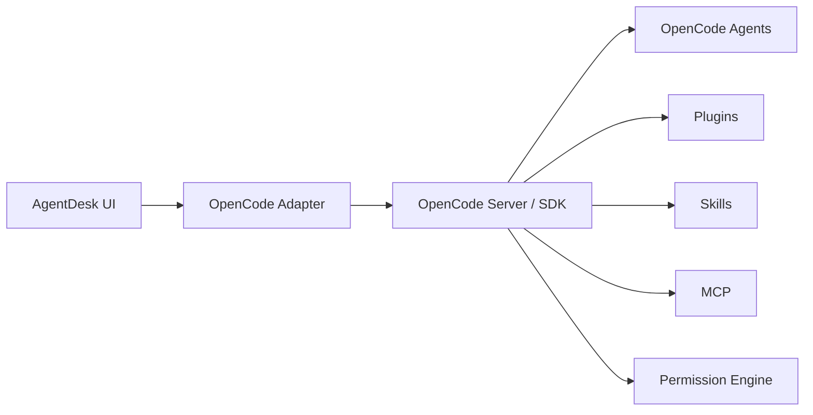
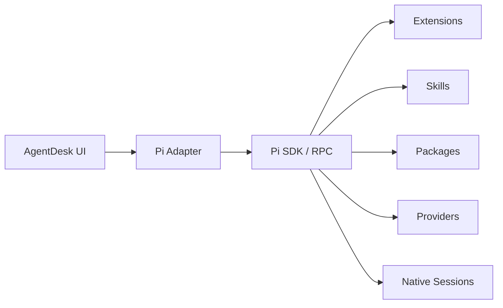
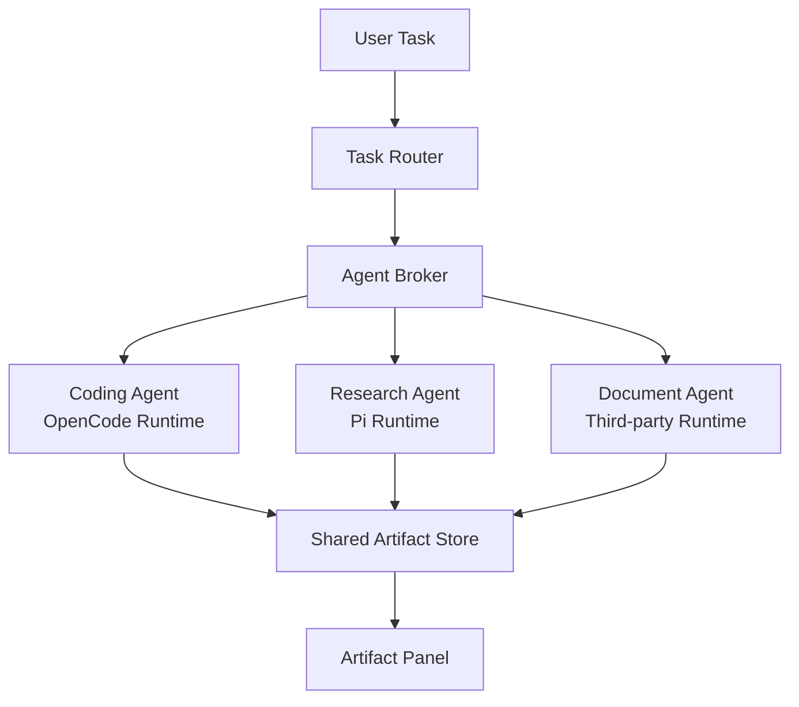

# AgentDesk 可插拔多 Agent 桌面平台 —— 开发实施文档

> 文档用途：作为 Claude Code / Codex / OpenCode / Pi / 其他 AI 编程助手持续开发本项目时的**唯一工程执行基线与进度总控文件**。  
> 文档版本：`v0.3`  
> 更新日期：`2026-08-03`  
> 项目代号：`AgentDesk`  
> 核心定位：基于 OpenCode Desktop 现有 UI/交互体验，构建一个**可插拔、可解耦、可扩展的多 Agent 桌面平台**。  
> 核心 Runtime：OpenCode、Pi。  
> 运行模式：Pure OpenCode、Pure Pi、Hybrid。  
> 长期目标：允许第三方 Coding Agent、Document Agent、Research Agent、Browser Agent、Data Agent 等通过 Adapter/SDK 接入，并共享 Workspace、Artifact、Permission、Session View 与任务协作能力。

---

# 0. AI 开发者必须先读：执行协议

## 0.1 本文档是唯一工程状态来源

所有 AI 编程助手在开始编码前必须执行：

1. 阅读本文件的 `0`、`1`、`2`、`3`、`4`、`8`、`9`、`19`、`20`、`21`。
2. 阅读 `CURRENT_PROGRESS`。
3. 找到当前 Milestone 下第一个可执行且未完成任务。
4. 将该任务从 `[ ]` 改为 `[~]` 后再开始编码。
5. 不得无理由跨 Milestone 大规模开发。
6. 不得为了“统一”而删除 Pi/OpenCode 的原生扩展能力。
7. 不得把 Platform Core 直接依赖 Pi/OpenCode SDK。
8. 完成任务后必须运行验收命令并记录结果。
9. 验收通过后才能将 `[~]` 改为 `[x]`。
10. 每次完成任务必须同步更新：
   - `CURRENT_PROGRESS`
   - `TASK_EVIDENCE`
   - `CHANGE_LOG`
   - 如发生架构决策，更新 `DECISION_LOG`

不得只在聊天里回复“完成”，而不修改本文档。

---

## 0.2 状态标识

- `[ ]`：NOT_STARTED
- `[~]`：IN_PROGRESS
- `[x]`：DONE + 已验收
- `[!]`：BLOCKED
- `[-]`：CANCELLED / 不再实施

只有满足以下条件才能标记 `[x]`：

- 真实代码已经落盘；
- 核心路径不是 mock；
- 对应测试/检查通过；
- UI 类任务已经实际启动验证；
- 没有隐藏性破坏 Native Pi / Native OpenCode；
- 已留下可复现的完成证据。

---

## 0.3 CURRENT_PROGRESS

AI 每次开始或结束工作都必须更新本块。

```yaml
CURRENT_PROGRESS:
  document_version: "0.3"
  current_milestone: M01
  current_task: M01-T08
  last_completed_task: "M00-T01/T07/T08（vendor 基线）、M01-T01..T07（平台包骨架）、M02-T01..T10（协议）、M03-T01..T08（注册表）、M04-T01..T09（事件总线）、M05-T01、M06-T01/T03（适配器骨架）"
  overall_status: FOUNDATION_IN_PROGRESS
  active_mode_focus: REUSE_FIRST
  blockers: ["本机未安装 bun，vendor 内 opencode/pi 全量安装与原生启动验收待执行"]
  next_action: "安装 bun 后在 AgentDesk/vendor 执行 M00-T02..T09 原生启动验收"
  last_updated_at: "2026-08-03"
  updated_by: "AI"
```

---

## 0.4 每次开发的标准工作循环

```text
读取本 MD
   ↓
读取 CURRENT_PROGRESS
   ↓
检查 git status
   ↓
找到目标 Task
   ↓
标记 [~]
   ↓
编码
   ↓
测试 / 启动 / 验收
   ↓
填写 TASK_EVIDENCE
   ↓
标记 [x]
   ↓
更新 CURRENT_PROGRESS
   ↓
更新 CHANGE_LOG
```

如果中途失败：

```text
任务 [~]
   ↓
记录原因
   ↓
无法继续则 [!]
   ↓
blockers 加入 CURRENT_PROGRESS
```

---

## 0.5 AI 禁止事项

AI 不得：

1. 未做 Runtime Adapter 就让 UI 大量直接 import OpenCode 内部业务对象。
2. 在 `platform-core` 中 import Pi SDK。
3. 在 `platform-core` 中 import OpenCode SDK。
4. 为了统一配置而删除 `.pi/`、`.opencode/` 原生能力。
5. 将 Pi Extension 转译成 AgentDesk Extension 后再运行。
6. 将 OpenCode Plugin 转译成 AgentDesk Plugin 后再运行。
7. 把 Pi Native SubAgent 与 AgentDesk Cross-Runtime Agent Broker 混为一个概念。
8. 使用 `if (runtime === 'pi')` 作为长期架构判断方式；应优先使用 Capability。
9. 修改第三方 Runtime Session 内部格式并将其变成 AgentDesk 私有格式。
10. 在 Native 模式偷偷插入 Hybrid Orchestrator。
11. 未经权限系统直接执行高风险系统操作。
12. 通过一次性脚本绕过正式 Tool / Artifact API 来假装完成 Work 能力。
13. 为完成 UI 演示而把核心逻辑永久 hardcode。

---

# 1. 产品定义

## 1.1 一句话定义

AgentDesk 是一个以 OpenCode Desktop 交互体验为基础的**桌面 Agent 容器和多 Agent 工作平台**。它可以运行原生 OpenCode、原生 Pi，也可以在 Hybrid 模式下组合多个不同 Agent，完成代码、文档、表格、演示文稿、PDF、研究、数据分析等真实工作。

---

## 1.2 本项目不是“OpenCode + Pi 切换按钮”

错误理解：

```text
Desktop
  ├── OpenCode
  └── Pi
```

正确理解：

```text
AgentDesk Platform
      │
      ├── Runtime System
      ├── Agent System
      ├── Capability System
      ├── Artifact System
      ├── Workspace System
      ├── Permission System
      ├── Broker / Router
      └── Extension System
              │
      ┌───────┼────────┐
      ▼       ▼        ▼
 OpenCode    Pi     Third-party
 Runtime   Runtime      Runtime
```

AgentDesk Core 不应知道某个 Agent 的内部实现。

---

## 1.3 V1 用户必须能看到的核心能力

### 代码工作

- 打开本地项目目录；
- 文件树；
- 对话；
- 代码读取/修改；
- Diff；
- Terminal；
- Git 状态；
- 测试/命令执行；
- Tool Call 过程；
- Permission 弹窗。

### Work 工作

- 创建/修改 Markdown；
- 创建/修改 DOCX；
- 创建/修改 XLSX；
- 创建/修改 PPTX；
- PDF 读取与渲染；
- Artifact Preview；
- Artifact Version；
- 导出和打开文件。

### Research / Data

- Web Search；
- Web Fetch；
- 文件资料读取；
- Python 数据分析；
- 表格与图表；
- 生成研究报告；
- 生成最终 Artifact。

---

## 1.4 V1 三种一级运行模式

必须同时支持：

```text
MODE_NATIVE_OPENCODE
MODE_NATIVE_PI
MODE_HYBRID
```

### MODE_NATIVE_OPENCODE

- AgentDesk Router：OFF
- AgentDesk Broker：OFF
- OpenCode 自己管理 Agent/Plugin/Skill/MCP/Permission/Session
- AgentDesk 只负责 Desktop、统一显示、Workspace 与可选 Artifact 展示

### MODE_NATIVE_PI

- AgentDesk Router：OFF
- AgentDesk Broker：OFF
- Pi 自己管理 Session/Extension/Skill/Package/Provider
- Pi 原生 Extension 必须继续生效
- AgentDesk 主要做 Desktop UI Bridge 和结果展示

### MODE_HYBRID

- AgentDesk Router：ON
- AgentDesk Broker：ON
- 可以按 Capability 选择 Agent
- 可以跨 Runtime 委派任务
- 使用共享 Artifact 做结果交接

---

## 1.5 V1 非目标

暂不追求：

- 自研基础模型；
- 完整 Office 桌面编辑器替代品；
- 企业级多人在线协作；
- 云 IDE；
- 手机端；
- 大规模云端 Agent 集群；
- 完全自动化高风险系统操作；
- 100% 复刻 Pi TUI 自定义 UI。

---

# 2. 最重要的架构原则

## 2.1 Common where possible, native where necessary

统一：

- Session View；
- Message View；
- Streaming Event；
- Tool Call 展示；
- Permission 展示；
- Artifact；
- Workspace；
- Agent 状态；
- Error；
- Task Progress。

保持原生：

- Pi Extension 内部执行逻辑；
- Pi Skill / Package；
- Pi Provider；
- Pi Session 内部实现；
- OpenCode Plugin；
- OpenCode Skill；
- OpenCode MCP；
- OpenCode Agent；
- OpenCode Permission Engine；
- Runtime 特有配置。

---

## 2.2 依赖方向必须单向

正确：

```text
Desktop UI
   ↓
Platform API
   ↓
Runtime Protocol
   ↑
Adapters
   ↑
Pi / OpenCode SDK
```

代码层规则：

```text
platform-core      -> runtime-protocol
runtime-opencode   -> runtime-protocol + OpenCode SDK
runtime-pi         -> runtime-protocol + Pi SDK/RPC
apps/desktop       -> platform APIs / UI bindings
```

禁止：

```text
platform-core -> OpenCode SDK
platform-core -> Pi SDK
artifact-core -> OpenCode internal types
agent-broker  -> Pi internal session type
```

---

## 2.3 Adapter 只做边界转换

Adapter 允许：

- 初始化 Runtime；
- Session 创建/恢复；
- 请求发送；
- 取消；
- Event Mapping；
- Capability Manifest；
- Native Config 入口；
- Native Extension 元数据读取；
- Native Permission 事件映射。

Adapter 不允许：

- 重写 Runtime 内部 Agent Loop；
- 替换原生 Extension 系统；
- 修改 Native Session 结构；
- 把 Platform Tool 强行注入 Native 模式，除非用户明确启用 Bridge。

---

## 2.4 Runtime、Agent、Profile 必须分开

### Runtime

回答：**谁负责运行 Agent Loop？**

示例：

- OpenCode Runtime
- Pi Runtime
- Document Runtime
- Remote Runtime

### Agent

回答：**当前是什么执行角色？**

示例：

- Coding Agent
- Research Agent
- Document Agent
- Data Agent

### Profile

回答：**该 Agent 当前以什么工具、模型、权限、技能配置工作？**

示例：

```text
Profile: Deep Research
runtime = pi
agent = research
model = xxx
skills = [...]
tools = [...]
permissionPolicy = research-safe
```

---

## 2.5 Tool、Skill、Artifact、Workflow 必须分开

```text
Tool      = 能做什么
Skill     = 应该怎么做
Artifact  = 做出了什么
Workflow  = 多个步骤/Agent 如何协作
```

不可用一个“插件”概念全部混在一起。

---

# 3. 总体系统架构

```mermaid
flowchart TB
    UI[AgentDesk Desktop\nOpenCode-based UI\nSolidJS + Electron]

    CORE[AgentDesk Platform Core]
    SR[Session Registry]
    RR[Runtime Registry]
    AR[Agent Registry]
    CR[Capability Registry]
    EB[Unified Event Bus]
    PR[Permission Coordinator]
    WS[Workspace Service]
    AS[Artifact Service]
    DB[(SQLite)]

    BROKER[Agent Broker]
    ROUTER[Task Router]

    OCAD[OpenCode Runtime Adapter]
    PIAD[Pi Runtime Adapter]
    EXTAD[Third-party Runtime Adapter]

    OC[OpenCode Runtime]
    PI[Pi Runtime]
    DOC[Document / Other Runtime]

    OCN[OpenCode Native Ecosystem\nPlugins / Skills / MCP / Agents]
    PIN[Pi Native Ecosystem\nExtensions / Skills / Packages / Providers]

    UI -->

### M00-T01/T07/T08
- 状态：DONE
- 完成时间：2026-08-03
- 修改文件：
  - `AgentDesk/vendor/opencode/`（完整拷贝，commit 1882c33）
  - `AgentDesk/UPSTREAM_SYNC.md`
- 执行命令：`robocopy 开源参考/opencode AgentDesk/vendor/opencode /E /MT`
- 验证结果：PASS
- 实际验证：`codegraph index` 在 vendor/opencode 内可构建完整索引（3184 文件）。
- 遗留问题：本机无 bun，M00-T02..T09（安装/启动/原生 session）待执行。

### M01-T01..T08 / M02-T01..T10 / M03-T01..T08 / M04-T01..T09
- 状态：DONE（骨架与协议层）
- 完成时间：2026-08-03
- 修改文件：
  - `AgentDesk/packages/runtime-protocol/`（AgentRuntime/Manifest/Event/Capability/Artifact/Tool/Skill/Profile）
  - `AgentDesk/packages/platform-core/`、`registry-core/`、`event-bus/`、`runtime-demo/`
- 执行命令：`npm install && npm run typecheck && npm test && npm run check:isolation && codegraph init -i`（node 24 + typescript）
- 验证结果：PASS
- 实际验证：`tsc --noEmit` 全量通过；契约测试 14/14 PASS（DemoRuntime 注册→创建 Session→事件流→SessionRegistry 状态同步）；反耦合检查通过；codegraph 索引 4,468 文件（65,336 节点）。
- 遗留问题：CI 化待做；M00-T02..T09 原生启动验收需 bun。

### M05-T01..T08 / M06-T01..T10（骨架）
- 状态：DONE（骨架 + 原型）
- 完成时间：2026-08-03
- 修改文件：
  - `AgentDesk/packages/runtime-opencode/`（基于 `@opencode-ai/sdk@1.18.11`）
  - `AgentDesk/packages/runtime-pi/`（基于 pi-web HTTP/SSE API）
- 执行命令：`npm run typecheck && npm test`
- 验证结果：PASS（类型层 + 映射单元测试）；原生 E2E 待 bun + 真机验证
- 实际验证：适配器映射函数（OpenCode Event→AgentEvent、Pi SSE→AgentEvent）有单元测试。
- 遗留问题：原生 E2E（G05/G06）需在装有 bun 的机器上跑 vendor 安装后验证。 CORE
    CORE --> SR
    CORE --> RR
    CORE --> AR
    CORE --> CR
    CORE --> EB
    CORE --> PR
    CORE --> WS
    CORE --> AS
    CORE --> DB

    CORE --> BROKER
    BROKER --> ROUTER

    RR --> OCAD
    RR --> PIAD
    RR --> EXTAD

    OCAD --> OC
    PIAD --> PI
    EXTAD --> DOC

    OC --> OCN
    PI --> PIN
```

---

# 4. 运行模式架构

## 4.1 Pure OpenCode



要求：

- 不启用 AgentDesk Task Router；
- 不启用跨 Runtime Broker；
- OpenCode Native Config 可直接访问；
- OpenCode 原生升级尽量保持兼容。

---

## 4.2 Pure Pi



要求：

- 不启用 AgentDesk Task Router；
- 不启用跨 Runtime Broker；
- Pi Extension/Skill/Package 原生加载；
- Pi UI 交互通过 PiUIBridge 映射到 Desktop；
- 对 TUI-only Extension 做兼容性声明，而不是破坏性改造。

---

## 4.3 Hybrid



要求：

- Agent 之间原则上不直接持有对方 Runtime 对象；
- 跨 Runtime 调用必须经过 Broker；
- 大结果交接优先使用 Artifact，而不是复制全部聊天历史；
- Task Router 基于 Capability / Profile / 用户指定进行选择。

---

# 5. 推荐 Monorepo 目录

```text
agentdesk/
│
├── AGENTDESK_DEVELOPMENT.md
├── package.json
├── bun.lock
│
├── vendor/                        # 开源项目完整拷贝（零修改）
│   ├── README.md                  # 复用映射：已引入 / 后期引入
│   ├── opencode/                  # UI/Desktop/Server/SDK 基线（commit 1882c33）
│   ├── pi/                        # Pi 原生 Runtime 基线（commit f0deb8d）
│   └── pi-web/                    # Pi 会话 Web UI（v0.8.6）
│
├── apps/
│   └── desktop/                   # 直接复用 vendor/opencode/packages/desktop
│       ├── electron/
│       └── renderer/
│
├── packages/
│   ├── platform-core/             # 零依赖；只依赖 agentdesk 协议包
│   ├── runtime-protocol/          # AgentRuntime/Manifest/Event/Capability/Artifact 类型
│   ├── agent-protocol/            # AgentDescriptor/AgentProfile
│   ├── event-protocol/            # AgentEvent union
│   ├── capability-protocol/       # Capability 定义
│   ├── artifact-protocol/         # Artifact 模型与 Lineage
│   ├── tool-protocol/             # Tool/Skill 定义
│   ├── registry-core/             # Runtime/Agent/Capability/Session Registry
│   ├── event-bus/                 # 统一事件流 + reducer
│   ├── runtime-opencode/          # 适配器：复用 @opencode-ai/sdk（npm 1.18.11）
│   ├── runtime-pi/                # 适配器：复用 pi-web HTTP/SSE + @earendil-works/pi-client
│   ├── runtime-remote/            # （规划）
│   ├── runtime-demo/              # 演示 Runtime：零依赖，用于 G02/G03/G22
│   │
│   ├── agent-broker/              # （规划：M18）
│   ├── task-router/               # （规划：M19）
│   │
│   ├── workspace-core/            # （规划：M10）
│   ├── artifact-core/             # （规划：M11）
│   ├── permission-core/           # （规划：M13）
│   ├── storage-core/              # （规划：M10，复用 opencode effect-sqlite）
│   ├── credential-core/           # （规划：M24）
│   ├── telemetry-core/            # （规划：M24）
│   │
│   └── agentdesk-extension-sdk/   # （规划：M21，参考 opencode packages/plugin v2）
│
├── agents/                        # 复用原生 Agent（opencode/pi），平台 Agent 后期叠加
│   ├── code/
│   ├── work/
│   ├── research/
│   └── data/
│
├── tools/                         # M13+ 逐项落地（现成 npm 库，见 5.3/31）
│   ├── filesystem/
│   ├── terminal/
│   ├── git/
│   ├── web/
│   ├── python/
│   ├── document/
│   ├── spreadsheet/
│   ├── slides/
│   └── pdf/
│
├── skills/                        # 复用原生 Skill，Platform Skill 后期叠加
│   ├── coding/
│   ├── research/
│   ├── business-report/
│   ├── spreadsheet-analysis/
│   └── presentation/
│
├── extensions/
│   └── examples/
│
└── tests/
    ├── contracts/
    ├── integration/
    ├── e2e/
    └── fixtures/
```

> v0.3 起改为 **vendor 完整拷贝策略**：不 Fork、不改上游源码。上游项目整体拷入 `vendor/`，AgentDesk 平台层独立放在 `packages/`，适配器通过 npm 包或 `file:` 引用 vendor 内源码。上游升级 = 整体替换 `vendor/` 目录，AgentDesk 代码零冲突。

## 5.1 开源复用总策略（v0.3 新增）

**原则：能用现成的直接完整拿来用，禁止重复造轮子。**

1. 凡是 `vendor/` 内已经具备的能力，AgentDesk 一律通过调用/嵌入复用，不重写。
2. 上游项目保持**零修改**；任何必须的改动记录到 `AGENTDESK_PATCHES.md`，并尽量以独立 package 或配置注入完成。
3. AgentDesk 自研范围只限“平台编排层”：
   - Runtime/Agent/Capability/Event/Artifact 协议；
   - Registry、Event Bus、Broker、Task Router；
   - Runtime Adapter（薄封装，只做边界转换）。
4. 优先使用上游已发布的 npm 包（如 `@opencode-ai/sdk`），版本与 `vendor/` 内 commit 对齐。

## 5.2 参考项目清单与复用决策表

| 开源项目（`开源参考/`） | 决策 | 说明 |
|---|---|---|
| **opencode**（commit 1882c33） | ✅ 直接完整采用，已拷入 `vendor/opencode` | 桌面壳 `packages/desktop`（Electron）、Web App `packages/app`、UI `packages/ui`、Server `packages/server`、SDK `packages/sdk/js`（npm `@opencode-ai/sdk@1.18.11`）、协议 `packages/protocol`、SQLite schema `packages/schema`、插件系统 `packages/plugin` v2 |
| **pi**（commit f0deb8d） | ✅ 直接完整采用，已拷入 `vendor/pi` | 第二 Runtime 基线：`packages/coding-agent`、`packages/server`（RPC）、`packages/client`（`@earendil-works/pi-client`，未发布 npm，用 `file:` 引用）、`packages/protocol` |
| **pi-web**（v0.8.6） | ✅ 直接完整采用，已拷入 `vendor/pi-web` | Pi 会话 Web UI：`lib/agent-client.ts`、`lib/rpc-manager.ts`、`lib/session-reader.ts`、`app/api/**`（HTTP + SSE）。Pi Runtime Adapter 直接复用其 HTTP/SSE API 形态；其 UI 组件作为 Pi 会话浏览/管理视图候选 |
| **anything-llm**（commit 1530f73） | ⏳ 后期引入（M14/M23 触发） | 文档/知识/工作区 Runtime：`collector/`（文档摄取）、`server/`（workspaces/agents/RAG）、`frontend/`。用于 Document Agent、Data Agent、Workspace 知识库，避免自研 RAG 管线 |
| **open-webui**（commit 01f4282） | ⏳ 后期引入（可选） | 通用 Agent Web UI 与 Pipelines/RAG 参考。仅作功能对照，不直接进 V0.1 桌面壳 |
| **desktop**（open-webui/desktop，commit 0931b46） | ❌ 不引入 | Electron 壳与 opencode `packages/desktop` 职责重复；桌面壳直接复用 opencode desktop |

## 5.3 禁止重复造轮子清单（对照）

| 能力 | 直接复用来源 | 禁止自研 |
|---|---|---|
| Electron 桌面壳 / 窗口 / 更新 / WSL | `vendor/opencode/packages/desktop` | ❌ 新写 Electron main |
| 会话 UI / Chat / Diff / Tool call UI | `vendor/opencode/packages/app` + `packages/ui` | ❌ 新写聊天 UI |
| OpenCode 运行时 | `@opencode-ai/sdk` + `vendor/opencode/packages/server` | ❌ 重写 OpenCode 协议 |
| Pi 运行时 | `vendor/pi` + `vendor/pi-web` API | ❌ 重写 Pi RPC |
| SQLite 存储 | opencode `packages/schema` + `effect-sqlite-node` | ❌ 自建 ORM |
| 插件/扩展机制 | opencode `packages/plugin` v2 作为 AgentDesk Extension SDK 基础 | ❌ 重造插件加载器 |
| 文档/知识/工作区 | anything-llm（后期） | ❌ 自研 RAG/摄取管线 |
| 文档/表格/幻灯/PDF 读写 | 现成 npm 库（见第 31 节） | ❌ 自写解析器 |


---

# 6. Runtime Protocol

## 6.1 基础接口

建议定义：

```ts
export interface AgentRuntime {
  readonly manifest: RuntimeManifest

  initialize(config: RuntimeInitConfig): Promise<void>

  healthCheck(): Promise<RuntimeHealth>

  getCapabilities(): Promise<AgentCapabilities>

  createSession(input: CreateRuntimeSessionInput): Promise<RuntimeSessionRef>

  resumeSession(input: ResumeRuntimeSessionInput): Promise<RuntimeSessionRef>

  send(
    session: RuntimeSessionRef,
    request: RuntimeRequest,
  ): AsyncIterable<AgentEvent>

  cancel(session: RuntimeSessionRef): Promise<void>

  disposeSession?(session: RuntimeSessionRef): Promise<void>

  dispose(): Promise<void>

  getNativeConfigDescriptor?(): Promise<NativeConfigDescriptor>

  listNativeExtensions?(): Promise<NativeExtensionDescriptor[]>

  listNativeSkills?(): Promise<NativeSkillDescriptor[]>

  listNativeAgents?(): Promise<NativeAgentDescriptor[]>
}
```

---

## 6.2 RuntimeManifest

```ts
export interface RuntimeManifest {
  id: string
  name: string
  version: string
  adapterVersion: string
  vendor?: string

  execution:
    | "embedded-sdk"
    | "child-process-rpc"
    | "local-http"
    | "remote-http"

  nativeConfig: boolean
  nativeExtensions: boolean
  nativeSkills: boolean
  nativeAgents: boolean
}
```

---

## 6.3 Runtime 不允许泄漏内部对象

禁止：

```ts
interface AgentDeskSession {
  opencodeSession: OpenCodeSession
}
```

应为：

```ts
interface AgentDeskSessionRuntimeBinding {
  runtimeId: string
  nativeSessionId: string
  opaqueMetadata?: Record<string, unknown>
}
```

`opaqueMetadata` 只能由对应 Adapter 解析。

---

# 7. Capability System

## 7.1 禁止长期依赖 runtimeId 判断功能

错误：

```ts
if (runtime.id === "pi") {
  showExtensionTab()
}
```

推荐：

```ts
if (capabilities.nativeExtensions) {
  showNativeExtensionTab()
}
```

---

## 7.2 建议 Capability 定义

```ts
export interface AgentCapabilities {
  streaming: boolean
  cancellation: boolean
  sessions: boolean
  sessionBranching?: boolean

  tools: boolean
  nativeTools?: boolean
  nativeExtensions?: boolean
  nativeSkills?: boolean
  nativePackages?: boolean
  nativePlugins?: boolean
  nativeMcp?: boolean
  nativeSubagents?: boolean
  nativePermissions?: boolean

  filesystem?: CapabilityLevel
  terminal?: CapabilityLevel
  git?: CapabilityLevel
  web?: CapabilityLevel
  browser?: CapabilityLevel
  python?: CapabilityLevel

  document?: CapabilityLevel
  spreadsheet?: CapabilityLevel
  slides?: CapabilityLevel
  pdf?: CapabilityLevel
  image?: CapabilityLevel

  artifactEmission?: boolean
  structuredProgress?: boolean
  uiInteraction?: boolean
}

type CapabilityLevel = "none" | "read" | "read-write" | "advanced"
```

---

## 7.3 Capability 来源

Capability 可能来自：

1. Runtime 固有能力；
2. Native Extension；
3. AgentDesk Platform Tool；
4. Agent Profile；
5. 当前安全策略；
6. 当前系统环境。

需要有：

```text
Raw Runtime Capability
        +
Native Extension Capability
        +
Platform Capability
        -
Permission / Policy Restriction
        =
Effective Capability
```

---

# 8. Event Protocol

## 8.1 统一 Event 类型

```ts
export type AgentEvent =
  | SessionStartedEvent
  | SessionResumedEvent
  | AssistantMessageDeltaEvent
  | AssistantMessageCompletedEvent
  | ThinkingDeltaEvent
  | ToolCallStartedEvent
  | ToolCallProgressEvent
  | ToolCallCompletedEvent
  | PermissionRequestedEvent
  | PermissionResolvedEvent
  | ArtifactCreatedEvent
  | ArtifactUpdatedEvent
  | TaskProgressEvent
  | NativeUIRequestEvent
  | UsageEvent
  | ErrorEvent
  | SessionCompletedEvent
```

---

## 8.2 Event Mapper

每个 Adapter 实现：

```text
Native Event
   ↓
Runtime-specific Event Mapper
   ↓
AgentDesk AgentEvent
   ↓
Unified Event Bus
   ↓
Desktop UI / Store / Logs
```

不得让 Desktop UI 直接订阅 Pi/OpenCode 私有 Event。

---

## 8.3 Native Event Escape Hatch

为避免协议限制原生能力，允许：

```ts
interface NativeRuntimeEvent extends BaseAgentEvent {
  type: "runtime.native"
  runtimeId: string
  eventName: string
  payload: unknown
}
```

要求：

- UI 默认不依赖它；
- Runtime 专属面板可以解析；
- 不可拿它代替正式通用 Event。

---

# 9. Session Ownership

## 9.1 原则

```text
Pi Session        belongs to Pi
OpenCode Session  belongs to OpenCode
AgentDesk Session belongs to AgentDesk
```

AgentDesk Session 是上层映射，不替换 Native Session。

---

## 9.2 数据结构

```ts
interface AgentDeskSession {
  id: string
  workspaceId: string
  mode: "native-opencode" | "native-pi" | "hybrid"
  title: string
  createdAt: string
  updatedAt: string

  runtimeBindings: RuntimeSessionBinding[]
}

interface RuntimeSessionBinding {
  runtimeId: string
  nativeSessionId: string
  role?: string
  state: "active" | "idle" | "closed" | "error"
}
```

Hybrid 一个 AgentDesk Session 可以绑定多个 Native Session。

---

## 9.3 Native Branching 保留

若 Pi/OpenCode 支持自己的 Session branch/tree：

- 不强行转换为 AgentDesk Branch；
- 先通过 Native Capability 暴露；
- UI 可以提供 Runtime-specific branch panel；
- 后续再设计统一 Branch UX。

---

# 10. Runtime Registry

## 10.1 Registry

```ts
interface RuntimeRegistry {
  register(factory: RuntimeFactory): void
  unregister(runtimeId: string): void
  list(): RuntimeManifest[]
  get(runtimeId: string): AgentRuntime
  create(runtimeId: string, config: unknown): Promise<AgentRuntime>
}
```

---

## 10.2 Runtime 发现方式

V1：

- 内置 OpenCode；
- 内置 Pi；
- 内置 Demo Runtime；
- 本地 AgentDesk Extension 注册。

V2：

- npm package；
- local package；
- remote manifest；
- marketplace。

---

# 11. Agent Registry 与 Profile

## 11.1 AgentDescriptor

```ts
interface AgentDescriptor {
  id: string
  name: string
  description?: string
  runtimeId: string

  capabilities: Partial<AgentCapabilities>

  nativeAgentId?: string
  profileId?: string

  tags?: string[]
  enabled: boolean
}
```

---

## 11.2 ProfileDescriptor

```ts
interface AgentProfile {
  id: string
  name: string

  runtimeId: string
  agentId?: string
  model?: string

  platformTools?: string[]
  platformSkills?: string[]

  nativeSettings?: Record<string, unknown>

  permissionPolicyId?: string
}
```

---

## 11.3 预置 Profile

V1 至少：

```text
OpenCode Native
Pi Native
Code
Work
Research
Data
Auto
```

注意：

- `OpenCode Native` ≠ `Code`
- `Pi Native` ≠ `Research`
- `Code/Work/Research/Data` 是 AgentDesk Profile，可选择不同 Runtime 实现。

---

# 12. OpenCode Runtime Adapter

## 12.1 目标

OpenCode 应尽可能作为“完整原生 Runtime”运行。

Adapter 主要负责：

- Server lifecycle；
- SDK client；
- Session 映射；
- Event 映射；
- Permission 映射；
- Capability；
- Native config 页面入口；
- Plugin/Skill/Agent/MCP 可视化元数据。

---

## 12.2 Native OpenCode 必须保留

- OpenCode Agent；
- OpenCode Plugin；
- OpenCode Skill；
- OpenCode MCP；
- OpenCode Permission allow/ask/deny；
- OpenCode config；
- OpenCode Tool；
- OpenCode model/provider；
- OpenCode Session。

不得要求用户为了 AgentDesk 改写原有 `.opencode` 配置。

---

## 12.3 Native OpenCode Mode 验收

用户在 AgentDesk 中选择：

```text
Runtime: OpenCode Native
```

能够：

1. 打开项目；
2. 创建 OpenCode session；
3. 正常对话；
4. 调用 OpenCode tool；
5. Permission 弹窗；
6. 原生 Skill 生效；
7. 原生 Plugin 生效；
8. MCP 若配置则继续生效；
9. 关闭重开后 Session 可恢复；
10. AgentDesk Broker 未参与。

---

# 13. Pi Runtime Adapter

## 13.1 推荐接入优先级

优先方案：

```text
Pi SDK embedded
```

必要时支持：

```text
Pi RPC child process
```

Adapter 不应绑定某一种传输实现，可定义 Transport：

```ts
interface PiTransport {
  start(): Promise<void>
  send(message: unknown): Promise<void>
  events(): AsyncIterable<unknown>
  stop(): Promise<void>
}
```

---

## 13.2 Pi Native 生态必须保留

必须支持/保留：

- `.pi/settings.json`；
- global settings；
- Extensions；
- Skills；
- Prompt Templates；
- Packages；
- Providers；
- Sessions；
- Compaction；
- Extension lifecycle events；
- Extension custom tools。

AgentDesk 不重新解释 Pi Package 内容。

---

## 13.3 Pi Extension 加载原则

```text
Pi Runtime
   ↓
Pi 自己 discover/load Extensions
   ↓
Extension hooks / tools / state 正常工作
   ↓
Pi Adapter 只做 Event/UI Bridge
```

禁止：

```text
读取 Pi Extension
  ↓
转换成 AgentDesk Extension
  ↓
再执行
```

---

# 14. Pi Extension UI Bridge

## 14.1 为什么需要 Bridge

Pi Extension 可以发起用户交互；桌面模式需要将一部分交互映射到 Electron UI。

---

## 14.2 PiUIBridge

建议：

```ts
interface RuntimeUIBridge {
  confirm(request: ConfirmRequest): Promise<boolean>
  select(request: SelectRequest): Promise<string | string[] | null>
  input(request: InputRequest): Promise<string | null>
  notify(request: NotificationRequest): Promise<void>
  setStatus?(request: StatusRequest): Promise<void>
  setWidget?(request: RuntimeWidgetRequest): Promise<void>
}
```

Pi Adapter 将可映射的 `ctx.ui.*` 交互转换为 `NativeUIRequestEvent`。

---

## 14.3 Compatibility Level

```ts
type ExtensionCompatibility =
  | "FULL"
  | "PARTIAL"
  | "TUI_ONLY"
  | "UNSUPPORTED"
```

示例：

| Pi Extension 能力 | Desktop 支持策略 |
|---|---|
| custom tools | FULL |
| lifecycle hooks | FULL |
| permission confirm | FULL |
| select/input/notify | FULL |
| status | FULL/PARTIAL |
| simple widget | PARTIAL |
| terminal overlay | TUI_ONLY |
| 自定义复杂 TUI component | TUI_ONLY/PARTIAL |

遇到 TUI_ONLY：

- 不崩溃；
- UI 明确显示兼容性；
- 可以选择“在终端 Pi 中打开”。

---

# 15. Agent Broker 与 Task Router

## 15.1 Agent Broker

Broker 只在 Hybrid 模式启用。

```ts
interface AgentBroker {
  invoke(input: AgentInvocation): Promise<AgentInvocationResult>

  stream(input: AgentInvocation): AsyncIterable<AgentEvent>

  cancel(invocationId: string): Promise<void>
}
```

---

## 15.2 Agent 不直接跨 Runtime 持有对象

禁止：

```ts
piAgent.call(openCodeRuntime.internalAgent)
```

应为：

```text
Pi Agent
   ↓ task request
Agent Broker
   ↓
OpenCode Agent
```

---

## 15.3 Native SubAgent 与 Platform Agent 区分

### Native SubAgent

Runtime 内部自己管理：

```text
Pi → Pi native extension subagent
OpenCode → OpenCode native task/subagent
```

### Platform Agent

跨 Runtime：

```text
OpenCode
   ↓
AgentDesk Broker
   ↓
Document Runtime
```

二者不可共用一个 session tree 模型。

---

## 15.4 Task Router V1

V1 先做规则 + Capability，不急着做 LLM Router。

```ts
interface RouteDecision {
  agentId: string
  runtimeId: string
  reason: string
  matchedCapabilities: string[]
}
```

路由优先级：

1. 用户显式指定 Agent；
2. 当前 Profile 固定 Agent；
3. Required Capability；
4. Preferred Agent；
5. fallback；
6. 无法满足则提示用户。

---

# 16. Artifact System

## 16.1 Artifact 是跨 Agent 的稳定交接协议

不要使用“大段聊天文本复制”作为跨 Agent 的主要交接方式。

```text
Research Agent
   ↓
research.md / citations.json
   ↓
Artifact Store
   ↓
Document Agent
   ↓
report.docx
   ↓
Artifact Store
   ↓
Presentation Agent
   ↓
report.pptx
```

---

## 16.2 Artifact 模型

```ts
export type ArtifactType =
  | "code"
  | "text"
  | "markdown"
  | "document"
  | "spreadsheet"
  | "slides"
  | "pdf"
  | "image"
  | "chart"
  | "dataset"
  | "html"
  | "directory"

export interface Artifact {
  id: string
  workspaceId: string
  sessionId?: string
  invocationId?: string

  type: ArtifactType
  title: string
  uri: string
  mimeType?: string

  ownerAgentId?: string
  ownerRuntimeId?: string

  version: number
  parentVersionId?: string

  status: "creating" | "ready" | "editing" | "failed"

  createdAt: string
  updatedAt: string

  metadata: Record<string, unknown>
}
```

---

## 16.3 Artifact Renderer

Renderer 采用注册式：

```ts
interface ArtifactRendererRegistration {
  artifactType: string
  canRender(artifact: Artifact): boolean
  componentId: string
  priority: number
}
```

V1：

- Markdown renderer；
- Code renderer；
- Image renderer；
- PDF renderer；
- DOCX preview；
- XLSX preview；
- PPTX preview；
- Generic file renderer。

---

# 17. Tool System

## 17.1 两类 Tool

### Native Tool

由 OpenCode/Pi/第三方 Runtime 自己拥有。

### Platform Tool

AgentDesk 自己提供，主要服务 Hybrid 和 Work。

```text
Platform Tools
├── filesystem
├── terminal
├── git
├── web
├── python
├── document
├── spreadsheet
├── slides
└── pdf
```

---

## 17.2 Platform Tool API

```ts
interface ToolDefinition<TInput, TOutput> {
  id: string
  description: string
  inputSchema: unknown

  requiredPermissions: string[]
  requiredCapabilities?: string[]

  execute(
    input: TInput,
    context: ToolExecutionContext,
  ): Promise<TOutput>
}
```

---

## 17.3 Work Tool 必须是高层 Tool

不要只让 LLM 自己生成一次性脚本。

至少：

```text
document.create
document.edit
document.render

spreadsheet.create
spreadsheet.read
spreadsheet.set_cells
spreadsheet.format
spreadsheet.add_chart
spreadsheet.render

slides.create
slides.add_slide
slides.update_slide
slides.render

pdf.read
pdf.render
pdf.create
```

允许底层实现使用 Python/Node，但 Agent 调用的是稳定 Tool API。

---

# 18. Skill System

## 18.1 Native Skill 与 Platform Skill 双层共存

```text
Skills
├── Pi Native Skills
├── OpenCode Native Skills
└── AgentDesk Platform Skills
```

Native Skill 原样由对应 Runtime 管理。

---

## 18.2 Platform Skill Manifest

```yaml
name: business-report
version: 1.0.0

requiredCapabilities:
  - document.read-write

preferredAgents:
  - document-agent
  - pi-work

fallbackAgents:
  - opencode

artifacts:
  output:
    - document
```

---

## 18.3 Skill 与 Tool 不绑定

Skill 应尽量描述方法和流程；Tool 是实际执行接口。

---

# 19. AgentDesk Extension SDK

## 19.1 三层扩展体系

```text
Extensions
├── Native Pi Extensions
├── Native OpenCode Plugins
└── AgentDesk Extensions
```

三者不得混为一个生态。

---

## 19.2 AgentDesk Extension 可注册

```ts
agentdesk.registerRuntime(...)
agentdesk.registerAgent(...)
agentdesk.registerTool(...)
agentdesk.registerSkill(...)
agentdesk.registerArtifactRenderer(...)
agentdesk.registerSidebarPanel(...)
agentdesk.registerCommand(...)
agentdesk.registerSettingsPage(...)
```

---

## 19.3 V1 Extension 安全边界

V1 Extension 默认视为本地可信代码，但必须：

- 明确显示来源；
- 明确权限；
- 用户可禁用；
- 异常不能拖垮 Desktop 主进程；
- 后续预留 sandbox。

---

# 20. Permission 与安全

## 20.1 Permission 分层

```text
Native Permission Engine
          +
AgentDesk Platform Permission
          ↓
Desktop Permission UX
```

OpenCode Native：尊重 OpenCode 自己规则。

Pi Native：尊重 Extension/环境安全机制；AgentDesk 可承接可映射确认 UI。

Platform Tool：必须走 AgentDesk Permission Core。

---

## 20.2 Platform Permission Action

```text
filesystem.read
filesystem.write
filesystem.delete
external_directory.read
external_directory.write
terminal.execute
git.write
network.request
web.search
browser.control
python.execute
document.write
spreadsheet.write
slides.write
email.send
calendar.write
credential.read
```

---

## 20.3 Decision

```ts
type PermissionDecision = "allow" | "ask" | "deny"
```

支持：

- once；
- session；
- workspace；
- always；
- deny once；
- deny rule。

---

## 20.4 Electron 安全

必须：

- `contextIsolation: true`；
- Renderer 不直接拿 Node full access；
- 通过 preload IPC 白名单；
- 命令执行走受控 service；
- Secret 不进入聊天日志；
- API key 使用系统安全存储或加密 Vault；
- 避免任意 URL 打开造成 RCE；
- 下载/打开文件有边界检查。

---

# 21. Desktop UI 设计

## 21.1 原则

继续使用 OpenCode Desktop 的整体视觉、布局与交互风格，不重新造一套 UI。

核心新增：

```text
┌──────────────┬───────────────────────┬────────────────────────┐
│ Workspace    │ Agent Session         │ Artifact / Inspector   │
│              │                       │                        │
│ Projects     │ Chat                  │ Preview                │
│ Sessions     │ Thinking              │ Version                │
│ Agents       │ Tool Calls            │ Metadata               │
│ Artifacts    │ Permissions           │ Open / Export          │
│              │ Progress              │                        │
└──────────────┴───────────────────────┴────────────────────────┘
```

---

## 21.2 顶部 Runtime / Agent Selector

```text
Mode: [ Native / Hybrid ]

Agent: [ Auto ▾ ]

Auto
────────────
OpenCode Native
Pi Native
Code Agent
Research Agent
Document Agent
Data Agent
────────────
Installed Agents...
```

---

## 21.3 Native Configuration Panel

### OpenCode

- Models
- Agents
- Plugins
- Skills
- MCP
- Permissions
- Native config location

### Pi

- Models / Providers
- Extensions
- Skills
- Packages
- Prompts
- Native settings
- Compatibility status

UI 只做入口/可视化，不重写两边配置语义。

---

## 21.4 Hybrid Task UI

任务卡至少显示：

```text
Task #3
Status: running
Agent: Document Agent
Runtime: document-runtime
Parent: #1
Input Artifacts: research.md
Output Artifacts: report.docx
```

用户应能看到“哪个 Agent 正在做什么”。

---

# 22. Workspace System

## 22.1 Workspace

```ts
interface Workspace {
  id: string
  name: string
  rootPath: string
  createdAt: string
  updatedAt: string

  defaultProfileId?: string
  trustState: "trusted" | "untrusted"
}
```

---

## 22.2 Workspace Scope

一个 Workspace 共享：

- Session 列表；
- Artifact；
- Platform Skill；
- Platform Permission；
- Agent Profile；
- Runtime binding；
- Project config。

Native `.pi` / `.opencode` 仍由对应 Runtime 自己解析。

---

# 23. Storage 设计

SQLite 至少包含：

```text
workspaces
sessions
runtime_session_bindings
agents
agent_profiles
invocations
tasks
messages
artifacts
artifact_versions
permission_rules
permission_events
runtime_installations
extension_installations
settings
```

---

## 23.1 不重复保存大量 Native 数据

对于 Native Runtime：

AgentDesk 只保存必要映射和 UI 索引。

不要为了“统一”复制全部 Native Session 文件。

---

# 24. 第三方 Runtime 接入规范

## 24.1 接入目标

以后新增一个文档 Agent 时，只允许新增类似：

```text
packages/runtime-super-document/
```

不允许修改：

```text
platform-core
artifact-core
apps/desktop 核心逻辑
```

除非该 Agent 暴露了平台此前完全没有的新通用能力，而且必须通过协议版本升级解决。

---

## 24.2 第三方 Runtime 最小实现

```ts
class DemoDocumentRuntime implements AgentRuntime {
  manifest = {...}

  async initialize() {}
  async healthCheck() {}
  async getCapabilities() {}
  async createSession() {}
  async resumeSession() {}
  async *send() {}
  async cancel() {}
  async dispose() {}
}
```

注册：

```ts
runtimeRegistry.register(() => new DemoDocumentRuntime())
```

UI 应自动读取 manifest/capability 并显示。

---

## 24.3 解耦硬验收

必须有自动测试：

> 新增 `runtime-demo` 后，不修改 `platform-core`、`artifact-core`、`agent-broker` 和主要 Desktop 业务组件，就可以让 Demo Runtime 出现在 Runtime/Agent 列表并完成一次 Session。

失败则说明架构仍然耦合。

---

# 25. Document Agent 接入示例目标

为了证明不只支持 Coding Agent，V1 后期必须做一个最小 Document Agent Runtime Demo。

可以是：

- 自研简单 Runtime；
- 或接入一个合适第三方开源 Document Agent；
- 具体实现可后续替换。

它至少提供：

```text
document.read-write
spreadsheet.read-write
slides.read-write
pdf.read
artifactEmission
```

完成任务：

> 读取一个 XLSX → 生成分析结果 → 生成 DOCX 报告 → 生成 PPTX。

用于验证平台不是 Coding Agent UI 的换皮。

---

# 26. 测试体系

## 26.1 Contract Tests

每个 Runtime 必须跑同一套 Contract：

```text
initialize
healthCheck
createSession
resumeSession
stream event
cancel
error mapping
capability manifest
cleanup
```

---

## 26.2 Native Preservation Tests

### OpenCode

- 原生 Plugin 生效；
- 原生 Skill 生效；
- 原生 Permission 生效；
- 原生 MCP 不受 AgentDesk 影响。

### Pi

- project extension 生效；
- global extension 生效；
- custom tool 生效；
- lifecycle hook 生效；
- skill 生效；
- package 生效；
- reload 能力（若当前嵌入模式支持）；
- Native UI bridge 能处理 confirm/select/input/notify。

---

## 26.3 Anti-Coupling Tests

CI 增加规则：

```text
packages/platform-core/**
不得 import
  @opencode-*
  OpenCode internal package
  @earendil-works/pi-*
```

可以使用 ESLint/dep-cruiser/madge/custom test 实现。

---

## 26.4 E2E 核心场景

### E2E-01 Pure OpenCode

```text
打开项目
→ 选择 OpenCode Native
→ 提问
→ Tool
→ Permission
→ 文件修改
→ Diff
→ Session 恢复
```

### E2E-02 Pure Pi

```text
打开项目
→ 选择 Pi Native
→ 加载 project extension
→ Extension 注册 tool
→ Agent 调用
→ UI confirm
→ Session 恢复
```

### E2E-03 Hybrid

```text
用户要求研究 + 文档 + 代码
→ Router
→ Pi Research
→ Artifact
→ Document Agent
→ Artifact
→ OpenCode Coding
→ 最终全部显示
```

### E2E-04 Third-party Runtime

```text
安装 Demo Runtime
→ Registry 自动发现
→ UI 显示
→ 创建 Session
→ 生成 Artifact
→ 卸载
```

---

# 27. 开发 Milestone 总览

| Milestone | 名称 | 目标 | Gate |
|---|---|---|---|
| M00 | Upstream Baseline | 可稳定运行 OpenCode Desktop | G00 |
| M01 | Platform Skeleton | 建立 AgentDesk 独立平台包 | G01 |
| M02 | Protocol Layer | 定义 Runtime/Event/Capability 等协议 | G02 |
| M03 | Registry Layer | Runtime/Agent/Capability/Session Registry | G03 |
| M04 | Event Bus | 统一事件流 | G04 |
| M05 | OpenCode Adapter | Native OpenCode 完整接入 | G05 |
| M06 | Pi Adapter | Native Pi 基础接入 | G06 |
| M07 | Pi Native Extensions | Pi 原生 Extension/Skill/Package 保留 | G07 |
| M08 | Pi UI Bridge | Pi Extension UI 映射 | G08 |
| M09 | Desktop Runtime UX | Runtime/Agent/Profile 选择与设置 | G09 |
| M10 | Workspace/Storage | Workspace + SQLite + Session mapping | G10 |
| M11 | Artifact Core | Artifact 协议、版本、Store | G11 |
| M12 | Artifact UI | 右侧预览与 Renderer Registry | G12 |
| M13 | Platform Tools | 基础 Tool 系统与权限 | G13 |
| M14 | Document Tools | DOCX/PDF | G14 |
| M15 | Spreadsheet Tools | XLSX/Data | G15 |
| M16 | Slides Tools | PPTX | G16 |
| M17 | Platform Skills | Skills 与 Profile | G17 |
| M18 | Agent Broker | Cross-runtime invocation | G18 |
| M19 | Task Router | Capability 路由 | G19 |
| M20 | Hybrid Mode | 多 Agent 工作流 | G20 |
| M21 | Extension SDK | AgentDesk 第三方扩展 API | G21 |
| M22 | Third-party Runtime SDK | 第三方 Runtime 接入验证 | G22 |
| M23 | Document Agent Demo | 验证通用工作 Agent | G23 |
| M24 | Hardening & Release | 安全、恢复、打包 | G24 |

---

# 28. 详细任务节点

## M00 — Upstream Baseline（v0.3 改为 vendor 完整拷贝策略）

目标：将可复用开源项目**完整拷贝**进 `AgentDesk/vendor/`，未修改前可稳定运行。

- [x] **M00-T01** 完整拷贝 OpenCode 上游到 `AgentDesk/vendor/opencode` 并记录 commit SHA（1882c33）
- [ ] **M00-T02** 安装依赖（`bun install`，需先安装 bun）
- [ ] **M00-T03** 启动 OpenCode server
- [ ] **M00-T04** 启动共享 app
- [ ] **M00-T05** 启动 Electron desktop
- [ ] **M00-T06** 完成一条原生 OpenCode Session
- [x] **M00-T07** 记录 upstream remote 与 commit（写入 `UPSTREAM_SYNC.md`）
- [x] **M00-T08** 建立 `UPSTREAM_SYNC.md`
- [ ] **M00-T09** 建立基础 smoke test（依赖 bun 安装完成）

### G00

必须证明：

```text
OpenCode 未经 AgentDesk 改造时能够正常运行。
```

---

## M01 — Platform Skeleton

> v0.3 落地：`AgentDesk/packages/` 独立 monorepo，零依赖纯 TS；协议包合并实现（runtime-protocol 含 event/capability/artifact 类型）。

- [x] **M01-T01** 新建 `platform-core`
- [x] **M01-T02** 新建 `runtime-protocol`
- [x] **M01-T03** 新建 `agent-protocol`（AgentDescriptor/AgentProfile 并入 runtime-protocol）
- [x] **M01-T04** 新建 `event-protocol`（AgentEvent union 并入 runtime-protocol）
- [x] **M01-T05** 新建 `capability-protocol`（AgentCapabilities 并入 runtime-protocol）
- [x] **M01-T06** 新建 `artifact-protocol`（Artifact 模型并入 runtime-protocol）
- [x] **M01-T07** 新建 `tool-protocol`（Tool/Skill 类型并入 runtime-protocol）
- [x] **M01-T08** 建立 package dependency rules（platform-core 零依赖；适配器可依赖 SDK）
- [ ] **M01-T09** CI 检查 platform-core 不依赖 Runtime SDK（脚本已建：`scripts/check-platform-isolation.ts`，待接入 CI）

### G01

- Platform Core 可单独编译；
- 不依赖 OpenCode/Pi SDK。

---

## M02 — Protocol Layer

- [ ] **M02-T01** 完成 `AgentRuntime` interface
- [ ] **M02-T02** 完成 `RuntimeManifest`
- [ ] **M02-T03** 完成 Runtime session reference
- [ ] **M02-T04** 完成 `AgentEvent` union
- [ ] **M02-T05** 完成 `AgentCapabilities`
- [ ] **M02-T06** 完成 `AgentDescriptor`
- [ ] **M02-T07** 完成 `AgentProfile`
- [ ] **M02-T08** 完成 Artifact protocol
- [ ] **M02-T09** 完成协议 versioning 策略
- [ ] **M02-T10** 为协议写 contract type tests

### G02

协议层可以被一个完全假的 Runtime 实现而无需 OpenCode/Pi。

---

## M03 — Registry Layer

- [ ] **M03-T01** Runtime Registry
- [ ] **M03-T02** Agent Registry
- [ ] **M03-T03** Capability Registry
- [ ] **M03-T04** Session Registry
- [ ] **M03-T05** Runtime lifecycle manager
- [ ] **M03-T06** Registry reactive subscription
- [ ] **M03-T07** Demo Runtime 注册
- [ ] **M03-T08** Registry 单元测试

### G03

动态注册 Demo Runtime 后能创建 session。

---

## M04 — Unified Event Bus

- [ ] **M04-T01** Event Bus
- [ ] **M04-T02** streaming message reducer
- [ ] **M04-T03** tool lifecycle reducer
- [ ] **M04-T04** permission lifecycle reducer
- [ ] **M04-T05** artifact event reducer
- [ ] **M04-T06** error normalization
- [ ] **M04-T07** native event escape hatch
- [ ] **M04-T08** event ordering test
- [ ] **M04-T09** cancellation event test

### G04

UI mock 可以只消费 AgentEvent 而不知道 Runtime 类型。

---

## M05 — OpenCode Runtime Adapter

> 复用：`@opencode-ai/sdk@1.18.11`（npm 已发布，与 `vendor/opencode` commit 1882c33 对齐）。SDK 提供 `createOpencodeClient` / `createOpencodeServer`，含 session、prompt、event stream、permission 等生成类型。

- [x] **M05-T01** 创建 `runtime-opencode`（骨架 + 基于 SDK 的 health/session/stream 原型）
- [~] **M05-T02** 接 OpenCode Server/SDK lifecycle（`createOpencodeClient({ baseUrl, directory })`）
- [~] **M05-T03** health check
- [~] **M05-T04** create session
- [ ] **M05-T05** resume session
- [~] **M05-T06** send/stream（SDK prompt + event stream 映射）
- [ ] **M05-T07** cancel
- [~] **M05-T08** OpenCode Event → AgentEvent
- [ ] **M05-T09** capability manifest
- [ ] **M05-T10** native permission event 映射
- [ ] **M05-T11** native config descriptor
- [ ] **M05-T12** native agent metadata
- [ ] **M05-T13** native skills metadata
- [ ] **M05-T14** plugin/MCP 元数据
- [ ] **M05-T15** OpenCode contract tests

### G05

Pure OpenCode 可完成完整 E2E，且 AgentDesk Router/Broker 未启动。

---

## M06 — Pi Runtime Adapter

> 复用：`vendor/pi`（coding-agent + server + client）+ `vendor/pi-web` HTTP/SSE API（`/api/agent/new`、`/api/agent/[id]`、`/api/agent/[id]/events`）。`@earendil-works/pi-client` 未发布 npm，通过 `file:vendor/pi/packages/client` 引用；Windows 下用 pi-web HTTP API 为主通道（pi-client unix transport 不支持 Windows）。

- [x] **M06-T01** 创建 `runtime-pi`（骨架 + pi-web HTTP API 原型）
- [x] **M06-T02** Spike：确认 pi-web HTTP/SSE 为默认通道（Windows 兼容），`pi-client` unix transport 仅限 Unix
- [x] **M06-T03** 确定默认 Transport：pi-web HTTP + SSE（Windows）/ pi-client unix socket（macOS/Linux）
- [ ] **M06-T04** Pi initialize
- [~] **M06-T05** health check
- [~] **M06-T06** create session（`POST /api/agent/new`）
- [ ] **M06-T07** resume session
- [~] **M06-T08** send/stream（`POST /api/agent/[id]` + SSE events）
- [ ] **M06-T09** cancel
- [~] **M06-T10** Pi Event → AgentEvent
- [ ] **M06-T11** capability manifest
- [ ] **M06-T12** Pi native session id 映射
- [ ] **M06-T13** Pi contract tests

### G06

不启用 Hybrid，Pi 可以在桌面完成基本对话 + tool call + session 恢复。

---

## M07 — Pi Native Extensions / Skills / Packages

- [ ] **M07-T01** project `.pi` settings 可识别
- [ ] **M07-T02** global settings 可识别
- [ ] **M07-T03** project Extension 加载
- [ ] **M07-T04** global Extension 加载
- [ ] **M07-T05** Extension custom tool 调用
- [ ] **M07-T06** Extension lifecycle hook 生效
- [ ] **M07-T07** Pi Skill 加载
- [ ] **M07-T08** Pi Package 加载
- [ ] **M07-T09** Prompt Template 保留
- [ ] **M07-T10** Provider 设置保留
- [ ] **M07-T11** Extension metadata 列表
- [ ] **M07-T12** reload 支持或明确兼容策略
- [ ] **M07-T13** Pi Native preservation integration test

### G07

Pi 在 AgentDesk 中不是“阉割版 Pi”。

至少证明一个真实 Extension 注册 custom tool 并被模型调用。

---

## M08 — Pi Extension UI Bridge

- [ ] **M08-T01** `NativeUIRequestEvent`
- [ ] **M08-T02** confirm bridge
- [ ] **M08-T03** select bridge
- [ ] **M08-T04** input bridge
- [ ] **M08-T05** notify bridge
- [ ] **M08-T06** status bridge
- [ ] **M08-T07** simple widget compatibility
- [ ] **M08-T08** TUI_ONLY detection
- [ ] **M08-T09** Compatibility badge
- [ ] **M08-T10** Unsupported UI 不导致 runtime 崩溃

### G08

Pi permission-gate 类 Extension 能通过桌面确认框正常继续。

---

## M09 — Runtime / Agent / Profile Desktop UX

- [ ] **M09-T01** Runtime selector
- [ ] **M09-T02** Agent selector
- [ ] **M09-T03** Profile selector
- [ ] **M09-T04** Mode selector
- [ ] **M09-T05** Runtime health indicator
- [ ] **M09-T06** Capability inspector
- [ ] **M09-T07** OpenCode native settings panel
- [ ] **M09-T08** Pi native settings panel
- [ ] **M09-T09** Pi extensions list
- [ ] **M09-T10** OpenCode plugins/skills list
- [ ] **M09-T11** 设置保存

### G09

用户能明确知道当前是 Native OpenCode / Native Pi / Hybrid 中哪一种。

---

## M10 — Workspace / Storage / Session Mapping

- [ ] **M10-T01** SQLite migrations
- [ ] **M10-T02** Workspace schema
- [ ] **M10-T03** AgentDesk Session schema
- [ ] **M10-T04** Runtime binding schema
- [ ] **M10-T05** Workspace service
- [ ] **M10-T06** recent workspace
- [ ] **M10-T07** session index
- [ ] **M10-T08** resume after app restart
- [ ] **M10-T09** Native session 不重复持久化测试
- [ ] **M10-T10** crash recovery 最小实现

### G10

应用关闭重开可以恢复 Workspace 与 Native Session 映射。

---

## M11 — Artifact Core

- [ ] **M11-T01** Artifact interface
- [ ] **M11-T02** Artifact repository
- [ ] **M11-T03** Artifact version
- [ ] **M11-T04** Artifact URI abstraction
- [ ] **M11-T05** Artifact create/update events
- [ ] **M11-T06** Artifact owner agent/runtime
- [ ] **M11-T07** Artifact lineage
- [ ] **M11-T08** Artifact deletion/retention policy
- [ ] **M11-T09** Artifact tests

### G11

任意 Runtime 可以只通过协议创建 Artifact，无需依赖 UI。

---

## M12 — Artifact UI / Renderer

- [ ] **M12-T01** Artifact right panel
- [ ] **M12-T02** Artifact list
- [ ] **M12-T03** version switch
- [ ] **M12-T04** Markdown renderer
- [ ] **M12-T05** Code renderer
- [ ] **M12-T06** Image renderer
- [ ] **M12-T07** PDF renderer
- [ ] **M12-T08** Generic renderer
- [ ] **M12-T09** Renderer Registry
- [ ] **M12-T10** Open file / reveal in folder

### G12

Renderer 可通过注册方式扩展，UI 无 artifact-type 大型 switch-case。

---

## M13 — Platform Tool Core + Permission

- [ ] **M13-T01** Tool Registry
- [ ] **M13-T02** Tool execution context
- [ ] **M13-T03** Permission Core
- [ ] **M13-T04** once/session/workspace decision
- [ ] **M13-T05** filesystem.read
- [ ] **M13-T06** filesystem.write
- [ ] **M13-T07** terminal.execute
- [ ] **M13-T08** git basic tools
- [ ] **M13-T09** web search/fetch adapter interface
- [ ] **M13-T10** python execution tool
- [ ] **M13-T11** Tool Call UI
- [ ] **M13-T12** Permission UI

### G13

Platform Tool 能独立于 Pi/OpenCode Runtime 执行，并受统一权限控制。

---

## M14 — Document / PDF Tools

> 复用：DOCX 读写用 `docx`（生成）+ `mammoth`（读取/预览）；PDF 读取 `pdfjs-dist`、渲染 `pdfjs-dist` + Canvas；可选接入 anything-llm collector 摄取文档进知识库。

- [ ] **M14-T01** document.create（`docx`）
- [ ] **M14-T02** document.read（`mammoth`/`docx`）
- [ ] **M14-T03** document.edit（`docx`）
- [ ] **M14-T04** document.render（HTML 预览）
- [ ] **M14-T05** DOCX Artifact
- [ ] **M14-T06** PDF read（`pdfjs-dist`）
- [ ] **M14-T07** PDF render
- [ ] **M14-T08** PDF Artifact
- [ ] **M14-T09** 文档预览 UI
- [ ] **M14-T10** roundtrip/edit tests

### G14

用户一句话可以产生可打开、可预览的真实 DOCX。

---

## M15 — Spreadsheet / Data Tools

> 复用：XLSX 读写用 `exceljs`（公式/样式/图表保留优先）；数据表处理 `danfojs` 或直接复用 opencode `packages/codemode` 的 Python 执行能力。

- [ ] **M15-T01** spreadsheet.create（`exceljs`）
- [ ] **M15-T02** spreadsheet.read（`exceljs`）
- [ ] **M15-T03** spreadsheet.set_cells
- [ ] **M15-T04** spreadsheet.format
- [ ] **M15-T05** spreadsheet.formula
- [ ] **M15-T06** spreadsheet.chart
- [ ] **M15-T07** XLSX Artifact
- [ ] **M15-T08** table preview
- [ ] **M15-T09** Python → dataset/artifact（复用 opencode codemode/python 执行）
- [ ] **M15-T10** formula 保留与 roundtrip 测试

### G15

能读取现有 XLSX、分析并生成新的 XLSX，公式和结构不被无故破坏。

---

## M16 — Slides Tools

> 复用：PPTX 用 `pptxgenjs`（生成）+ `pptx-preview`/`libreoffice`（缩略图，可选）。

- [ ] **M16-T01** slides.create（`pptxgenjs`）
- [ ] **M16-T02** slides.add_slide
- [ ] **M16-T03** slides.update_slide
- [ ] **M16-T04** text/image/table/chart elements
- [ ] **M16-T05** slides.render
- [ ] **M16-T06** PPTX Artifact
- [ ] **M16-T07** slide thumbnail preview
- [ ] **M16-T08** export/open
- [ ] **M16-T09** basic presentation tests

### G16

Agent 可以生成真实 PPTX，Artifact Panel 有可读预览。

---

## M17 — Platform Skills + Agent Profiles

- [ ] **M17-T01** Platform Skill manifest
- [ ] **M17-T02** Skill Registry
- [ ] **M17-T03** Skill loader
- [ ] **M17-T04** Code Profile
- [ ] **M17-T05** Work Profile
- [ ] **M17-T06** Research Profile
- [ ] **M17-T07** Data Profile
- [ ] **M17-T08** Profile capability calculation
- [ ] **M17-T09** Native Skills 与 Platform Skills UI 区分
- [ ] **M17-T10** Skill version / source metadata

### G17

用户能看出某 Skill 是 Pi/OpenCode Native 还是 AgentDesk Platform Skill。

---

## M18 — Agent Broker

- [ ] **M18-T01** Agent invocation model
- [ ] **M18-T02** Broker invoke
- [ ] **M18-T03** Broker stream
- [ ] **M18-T04** cancellation
- [ ] **M18-T05** parent/child task relation
- [ ] **M18-T06** artifact input reference
- [ ] **M18-T07** artifact output collection
- [ ] **M18-T08** recursion/depth protection
- [ ] **M18-T09** timeout/error policy
- [ ] **M18-T10** Broker audit log

### G18

Pi 侧任务可通过 Broker 调用 OpenCode Agent，但两边没有互相直接依赖。

---

## M19 — Task Router

- [ ] **M19-T01** required capability schema
- [ ] **M19-T02** agent eligibility filter
- [ ] **M19-T03** preferred agent
- [ ] **M19-T04** fallback agent
- [ ] **M19-T05** user explicit override
- [ ] **M19-T06** deterministic rule router
- [ ] **M19-T07** route reason display
- [ ] **M19-T08** no-capability failure UX
- [ ] **M19-T09** 路由单元测试

### G19

新增 Agent 后 Router 无需写 `if newAgent` 即可参与匹配。

---

## M20 — Hybrid Mode

- [ ] **M20-T01** Hybrid session lifecycle
- [ ] **M20-T02** multi-runtime bindings
- [ ] **M20-T03** task tree UI
- [ ] **M20-T04** Research → Artifact
- [ ] **M20-T05** Artifact → Document Agent
- [ ] **M20-T06** Artifact → Coding Agent
- [ ] **M20-T07** shared progress
- [ ] **M20-T08** partial failure recovery
- [ ] **M20-T09** user cancel child task
- [ ] **M20-T10** Hybrid E2E

### G20

完成一次至少 2 个 Runtime 的真实任务协作。

---

## M21 — AgentDesk Extension SDK

- [ ] **M21-T01** Extension manifest
- [ ] **M21-T02** registerRuntime
- [ ] **M21-T03** registerAgent
- [ ] **M21-T04** registerTool
- [ ] **M21-T05** registerSkill
- [ ] **M21-T06** registerArtifactRenderer
- [ ] **M21-T07** registerSidebarPanel
- [ ] **M21-T08** registerCommand
- [ ] **M21-T09** settings extension point
- [ ] **M21-T10** extension enable/disable
- [ ] **M21-T11** example extension

### G21

Extension 可以增加一个新 Tool 和一个 UI Panel，而不修改 AgentDesk Core。

---

## M22 — Third-party Runtime SDK / Decoupling Proof

- [ ] **M22-T01** runtime adapter template
- [ ] **M22-T02** runtime developer README
- [ ] **M22-T03** `runtime-demo` 独立 package
- [ ] **M22-T04** Demo health/session/stream
- [ ] **M22-T05** Demo Capability
- [ ] **M22-T06** Demo 自动出现在 UI
- [ ] **M22-T07** Demo Artifact emission
- [ ] **M22-T08** Demo Runtime uninstall/disable
- [ ] **M22-T09** Anti-coupling CI
- [ ] **M22-T10** 外部 package smoke test

### G22 — 最关键解耦 Gate

验收必须满足：

> 在不修改 `platform-core`、`artifact-core`、`agent-broker`、主要 Desktop Session UI 的情况下，仅增加 `runtime-demo` package 和注册信息，就完成新 Runtime 接入。

若必须修改上述核心包才能接入，则 **G22 = FAIL**，不得进入正式发布阶段。

---

## M23 — Document Agent Demo

> 复用：Document Runtime 优先接入 **anything-llm**（vendor 候选：collector 文档摄取 + server workspaces/agents + RAG）作为“知识/文档 Runtime”，文档读写复用第 14-16 节现成库。

- [ ] **M23-T01** 定义 Document Agent Capability
- [ ] **M23-T02** 实现或接入 Document Runtime（优先 anything-llm sidecar；备选纯 Tool 组合）
- [ ] **M23-T03** 注册 Document Agent
- [ ] **M23-T04** XLSX 输入 Artifact
- [ ] **M23-T05** 数据分析
- [ ] **M23-T06** DOCX 输出 Artifact
- [ ] **M23-T07** PPTX 输出 Artifact
- [ ] **M23-T08** Artifact lineage
- [ ] **M23-T09** Hybrid 调用 Document Agent
- [ ] **M23-T10** 完整 Work E2E

### G23

完成：

```text
现有 XLSX
→ 分析
→ DOCX 报告
→ PPTX 汇报
```

证明 AgentDesk 是通用 Agent Desktop，而不是 Coding Agent 换皮。

---

## M24 — Hardening / Release

- [ ] **M24-T01** Windows package
- [ ] **M24-T02** macOS package
- [ ] **M24-T03** Runtime crash isolation
- [ ] **M24-T04** restart/reconnect
- [ ] **M24-T05** credential vault
- [ ] **M24-T06** secret redaction
- [ ] **M24-T07** log export
- [ ] **M24-T08** diagnostics page
- [ ] **M24-T09** dependency license audit
- [ ] **M24-T10** upstream sync strategy 验证
- [ ] **M24-T11** performance baseline
- [ ] **M24-T12** installer smoke tests
- [ ] **M24-T13** release notes

### G24

V1 Release Candidate 可在目标 OS 安装，Pure OpenCode / Pure Pi / Hybrid 均通过 smoke test。

---

# 29. 各阶段不可破坏的回归矩阵

AI 每完成 M05 之后的重要任务，都应根据影响范围选择执行：

| 测试 | Native OpenCode | Native Pi | Hybrid |
|---|---:|---:|---:|
| 启动 Desktop | ✅ | ✅ | ✅ |
| 新 Session | ✅ | ✅ | ✅ |
| Resume | ✅ | ✅ | ✅ |
| Streaming | ✅ | ✅ | ✅ |
| Tool call UI | ✅ | ✅ | ✅ |
| Cancellation | ✅ | ✅ | ✅ |
| Native extension/plugin | ✅ | ✅ | N/A/Optional |
| Artifact | Optional | Optional | ✅ |
| Permission | Native | Native/Bridge | Platform+Native |
| Router | ❌ | ❌ | ✅ |
| Broker | ❌ | ❌ | ✅ |

Native 模式下 Router/Broker 意外启动视为回归。

---

# 30. Upstream Sync 策略

因为 UI 以 OpenCode 为基础，必须控制 Fork 漂移。

建议：

```text
upstream/opencode
      ↓
定期 merge/rebase
      ↓
agentdesk branch
```

原则：

1. 尽量通过新增 package 扩展；
2. 减少直接改上游 core；
3. UI 修改集中在少数稳定 extension point；
4. 对不可避免的上游 patch 写 `AGENTDESK_PATCHES.md`；
5. 每次上游同步跑 Native OpenCode regression。

---

# 31. 技术选择建议

## Desktop / UI

沿用 OpenCode 当前技术体系（v0.3 起直接复用 vendor，不再选型）：

```text
Electron 42（vendor/opencode/packages/desktop）
SolidJS（vendor/opencode/packages/app + packages/ui）
TypeScript
Bun（opencode workspace 包管理）
```

不在 V1 为了技术偏好改 React/Tauri。Pi 会话浏览/管理视图直接复用 pi-web 组件或在其上包装。

## Code Viewer

优先复用 OpenCode 现有代码/Diff 能力（`@pierre/diffs`、packages/ui）；如有需要再引入 Monaco。

## Terminal

复用/扩展现有 terminal 方案（`@lydell/node-pty` + opencode renderer），底层 PTY 与 Renderer 隔离。

## Storage

```text
SQLite（opencode packages/schema + effect-sqlite-node 直接复用）
```

## Document

```text
docx（生成/编辑） + mammoth（读取/预览）
```

要求可生成标准 DOCX 并可测试；可选 anything-llm collector 摄取文档。

## Spreadsheet

```text
exceljs（读写 XLSX、公式、样式、图表）
```

需要封装到 Tool 层；公式保留与 roundtrip 必须测试。

## Slides

```text
pptxgenjs（生成 PPTX）
```

统一经 `slides.*` Tool；缩略图预览可选 `pptx-preview`/LibreOffice。

## PDF

```text
pdfjs-dist（读取 + 渲染，Canvas/WebGL）
```

读取与渲染分离；预览复用 PDF.js 查看器能力。

---

# 32. 配置目录建议

```text
~/.agentdesk/
├── config.json
├── data.db
├── logs/
├── cache/
├── extensions/
├── skills/
└── runtimes/
```

项目级：

```text
<workspace>/
├── .agentdesk/
│   ├── config.json
│   ├── profiles/
│   └── skills/
│
├── .pi/
└── .opencode/
```

AgentDesk 不拥有 `.pi` / `.opencode`。

---

# 33. 版本与兼容性

## 33.1 Runtime Adapter Version

记录：

```text
AgentDesk protocol version
Adapter version
Native Runtime version
```

启动时检测：

```text
SUPPORTED
PARTIALLY_SUPPORTED
UNTESTED
INCOMPATIBLE
```

---

## 33.2 不假设上游 API 永久稳定

OpenCode/Pi 更新可能改变 SDK/API。

Adapter 内必须：

- 封装所有上游 API；
- 不让 UI 使用上游类型；
- 有 contract tests；
- 有 supported version range。

---

# 34. Logging / Observability

统一 Trace：

```text
sessionId
invocationId
taskId
runtimeId
nativeSessionId
agentId
toolCallId
artifactId
```

日志必须能回答：

> “用户这次任务最终为什么调用了 Pi，而不是 OpenCode？”

Hybrid Router 必须留下 `routeReason`。

---

# 35. Error Model

```ts
interface AgentDeskError {
  code: string
  message: string
  category:
    | "runtime"
    | "transport"
    | "permission"
    | "tool"
    | "artifact"
    | "storage"
    | "configuration"
    | "user"

  runtimeId?: string
  nativeCode?: string
  retryable: boolean
  details?: unknown
}
```

不要把 Native raw exception 直接扔到 UI。

---

# 36. 初始 Agent Profiles 建议

## OpenCode Native

```yaml
mode: native-opencode
runtime: opencode
router: false
broker: false
```

## Pi Native

```yaml
mode: native-pi
runtime: pi
router: false
broker: false
```

## Code

```yaml
mode: hybrid
preferredRuntime: opencode
capabilities:
  - filesystem.read-write
  - terminal.advanced
  - git.advanced
```

## Work

```yaml
mode: hybrid
preferredAgent: document-agent
fallback:
  - pi
  - opencode
capabilities:
  - document.read-write
  - spreadsheet.read-write
  - slides.read-write
```

## Research

```yaml
mode: hybrid
preferredRuntime: pi
capabilities:
  - web.advanced
  - pdf.read
  - document.read-write
```

## Data

```yaml
mode: hybrid
capabilities:
  - python.advanced
  - spreadsheet.read-write
  - chart
```

---

# 37. 第一版优先级

如果开发资源有限，严格按以下优先顺序：

### P0

```text
M00-M10
```

目标：Pure OpenCode + Pure Pi + Extension preservation。

### P1

```text
M11-M17
```

目标：Artifact + Work。

### P2

```text
M18-M20
```

目标：Hybrid。

### P3

```text
M21-M23
```

目标：真正平台化、第三方 Agent。

### P4

```text
M24
```

目标：Release。

---

# 38. V0.1 / V0.2 / V0.3 产品切片

## V0.1 — Dual Native Runtime

必须有：

- OpenCode UI；
- Pure OpenCode；
- Pure Pi；
- Pi Extensions；
- Runtime selector；
- Session mapping；
- 基础 permission UI。

## V0.2 — Work

增加：

- Artifact；
- DOCX；
- XLSX；
- PPTX；
- PDF；
- Work profile。

## V0.3 — Multi-Agent

增加：

- Agent Broker；
- Task Router；
- Hybrid；
- third-party runtime SDK；
- Document Agent。

---

# 39. 验收用真实用户场景

## 场景 A：纯 OpenCode

用户：

> 帮我检查当前项目 failing test 并修复。

验收：

- OpenCode 原生执行；
- Diff 正确；
- AgentDesk 没有抢走其 Agent Loop。

---

## 场景 B：纯 Pi + Extension

用户安装 Pi Extension，它注册一个自定义 Tool。

用户：

> 用刚才的工具分析这个项目。

验收：

- Extension 由 Pi 自己加载；
- custom tool 被 Pi 调用；
- 需要确认时 Desktop 出现 UI；
- 不转换为 AgentDesk Extension。

---

## 场景 C：Work

用户：

> 分析这个销售 Excel，输出一份 Word 报告和 PPT 汇报。

验收：

- 生成真实 XLSX/数据结果；
- DOCX；
- PPTX；
- Artifact 可预览；
- 有 lineage。

---

## 场景 D：Hybrid

用户：

> 调研这个开源项目的产品定位，给我写产品方案，然后修改当前仓库实现 MVP。

可能：

```text
Research Agent / Pi
        ↓
research.md
        ↓
Document Agent
        ↓
product-plan.docx
        ↓
OpenCode
        ↓
code changes
```

验收：

- 跨 Runtime；
- Artifact handoff；
- Task Tree 可见；
- 任一子任务失败可恢复。

---

# 40. Definition of Done — 整个 V1

只有全部满足才叫 AgentDesk V1：

- [ ] Pure OpenCode 可用
- [ ] Pure Pi 可用
- [ ] Pi 原生 Extension 可用
- [ ] Pi Skill/Package 可用
- [ ] OpenCode Plugin/Skill/MCP 不受破坏
- [ ] Runtime/Agent/Profile 解耦
- [ ] Capability 路由无 Runtime hardcode
- [ ] Session ownership 正确
- [ ] Artifact Core 可用
- [ ] DOCX 可创建修改预览
- [ ] XLSX 可创建修改分析
- [ ] PPTX 可创建修改预览
- [ ] PDF 可读取预览
- [ ] Platform Permission 可用
- [ ] Hybrid 至少支持两个 Runtime
- [ ] Agent Broker 可观测
- [ ] Task Router 有 reason
- [ ] Third-party Demo Runtime 通过 G22
- [ ] Document Agent Demo 通过 G23
- [ ] Desktop 可打包安装
- [ ] crash/restart 不丢基本进度
- [ ] 上游 OpenCode 同步策略可执行

---

# 41. TASK_EVIDENCE

> AI 每完成一个任务，在此追加。禁止删除历史证据。

<!--
示例：

### M05-T04
- 状态：DONE
- 完成时间：2026-08-04 12:30
- 修改文件：
  - `packages/runtime-opencode/src/session.ts`
- 执行命令：
  - `bun test packages/runtime-opencode`
  - `bun run typecheck`
- 验证结果：PASS
- 实际验证：成功通过 Adapter 创建 OpenCode 原生 session。
- 回归测试：Native OpenCode smoke PASS。
- 遗留问题：无。
-->

---

# 42. DECISION_LOG

| 日期 | ID | 决策 | 原因 | 影响 |
|---|---|---|---|---|
| 2026-08-03 | D-001 | Desktop UI 继续沿用 OpenCode 现有设计与技术栈 | 减少重复开发，降低 UI 成本 | 不在 V1 重写 React/Tauri |
| 2026-08-03 | D-002 | AgentDesk Core 与 Pi/OpenCode SDK 解耦 | 支持未来第三方 Agent | 增加 Runtime Protocol/Adapter |
| 2026-08-03 | D-003 | 同时支持 Pure OpenCode / Pure Pi / Hybrid | 保留原生能力并支持平台编排 | 三模式一级化 |
| 2026-08-03 | D-004 | Pi Extensions 保持 Native Loading | 避免阉割 Pi 扩展生态 | 新增 PiUIBridge 而非 Extension 转译 |
| 2026-08-03 | D-005 | Native Skill 与 Platform Skill 双层共存 | 保持 Runtime 原生能力同时支持跨 Agent 工作流 | UI 必须标记 Skill 来源 |
| 2026-08-03 | D-006 | Artifact 作为跨 Agent 主要交接对象 | 减少上下文复制，提高可追踪性 | 建立 Artifact Store/Lineage |
| 2026-08-03 | D-007 | Cross-runtime 调用统一经过 Agent Broker | 避免 Runtime 互相依赖 | Hybrid 由 Broker 管理 |
| 2026-08-03 | D-008 | 第三方 Runtime 接入作为硬解耦 Gate | 防止架构仅停留在接口层 | G22 未通过不得视为平台化完成 |
| 2026-08-03 | D-009 | 采用 vendor 完整拷贝策略（不 Fork、零修改上游） | 上游升级 = 替换 vendor/，AgentDesk 代码零冲突 | 目录体积增大；需要 UPSTREAM_SYNC 纪律 |
| 2026-08-03 | D-010 | 直接完整采用 opencode / pi / pi-web 三个仓库 | 按 5.2 决策表，桌面壳/UI/Server/SDK 全部复用 | 禁止重复造轮子清单生效（5.3） |
| 2026-08-03 | D-011 | 适配器优先复用已发布 npm 包（@opencode-ai/sdk） | 免去 bun workspace 耦合，独立可验证 | 版本需与 vendor/ commit 对齐 |
| 2026-08-03 | D-012 | Pi Runtime 默认走 pi-web HTTP/SSE API（Windows 兼容） | pi-client unix transport 不支持 Windows | macOS/Linux 可选 pi-client 直连 |
| 2026-08-03 | D-013 | 平台协议包采用零依赖纯 TS 设计 | 保证 G01/G22 反耦合可静态验证 | 平台层自研范围收敛到编排层 |
| 2026-08-03 | D-014 | anything-llm 作为 Document/Knowledge Runtime 候选（后期引入） | 避免自研 RAG/文档摄取管线 | M14/M23 触发时接入 sidecar |

---

# 43. CHANGE_LOG

| 日期 | 任务/版本 | 变更 | 执行者 |
|---|---|---|---|
| 2026-08-03 | DOC v0.2 | 将“双 Runtime Agent Desktop”升级为“可插拔多 Agent Desktop Platform”架构 | ChatGPT |
| 2026-08-03 | DOC v0.2 | 增加 Pure OpenCode / Pure Pi / Hybrid 三模式 | ChatGPT |
| 2026-08-03 | DOC v0.2 | 增加 Runtime/Agent/Profile/Capability 分层 | ChatGPT |
| 2026-08-03 | DOC v0.2 | 增加 Pi Native Extension/Skill/Package 保留策略与 UI Bridge | ChatGPT |
| 2026-08-03 | DOC v0.2 | 增加 Agent Broker、Task Router、Artifact Handoff | ChatGPT |
| 2026-08-03 | DOC v0.2 | 增加 AgentDesk Extension SDK 和 Third-party Runtime SDK | ChatGPT |
| 2026-08-03 | DOC v0.2 | 增加 G22 第三方 Runtime 硬解耦验收 | ChatGPT |
| 2026-08-03 | DOC v0.3 | 新增开源复用总策略与复用决策表（5.1/5.2/5.3），改为 vendor 完整拷贝 | Codex |
| 2026-08-03 | DOC v0.3 | M00 改为 vendor 拷贝基线；M05/M06 标注复用 SDK/pi-web 通道 | Codex |
| 2026-08-03 | DOC v0.3 | M14-M16/M23 明确复用库与 anything-llm 接入路径 | Codex |
| 2026-08-03 | DOC v0.3 | 第 31 节技术选择落地为具体库；第 46 节改为优先读 vendor 源码 | Codex |
| 2026-08-03 | M00/M01/M02/M03/M04/M05/M06 | 新建 AgentDesk/ 项目：vendor 拷贝 + 平台包骨架 + 适配器原型 | Codex |

---

# 44. AI 继续开发时直接使用的标准 Prompt

将下面这段与仓库一起交给 AI：

```text
你现在负责继续开发 AgentDesk。

首先完整阅读仓库根目录的：
AgentDesk_可插拔多Agent桌面平台_开发实施文档_v0.3.md
（如果项目中重命名为 AGENTDESK_DEVELOPMENT.md，则读取该文件。）

该文件是当前项目的唯一开发状态与架构基线。

你必须遵守：

1. 先读取 CURRENT_PROGRESS。
2. 检查 git status 和当前仓库代码状态。
3. 找到当前 milestone 中第一个未完成且未阻塞的 Task。
4. 开始前将任务标记为 [~]。
5. 先查 5.1/5.2/5.3 复用决策表：vendor 里已有的能力直接完整拿来用，禁止重复造轮子。
6. 只实现当前任务以及完成它必须的最小依赖。
7. 不得把 platform-core 直接依赖 Pi/OpenCode SDK。
8. 不得破坏 Pure Pi、Pure OpenCode 两种 Native 模式。
9. Pi Extension/Skill/Package 必须由 Pi 原生加载；OpenCode Plugin/Skill/MCP 必须由 OpenCode 原生管理。
10. 跨 Runtime 调用必须通过 Agent Broker。
11. 功能判断优先使用 Capability，不使用大量 runtimeId hardcode。
12. 完成后必须执行任务要求的测试/验收。
13. 只有验收通过才能标记 [x]。
14. 将完成证据写入 TASK_EVIDENCE。
15. 更新 CURRENT_PROGRESS 和 CHANGE_LOG。
16. 如果发现当前设计需要修改，先记录 DECISION_LOG，再做最小必要调整。
17. 不要只告诉我代码怎么写，请直接修改代码并验证。
18. 如果当前任务无法完成，不要假装完成，标记 [!] 并记录 blocker。

现在从 CURRENT_PROGRESS 指定的位置继续开发。
```

---

# 45. 给 AI 的架构自检问题

每完成一个较大 Milestone，AI 必须回答并记录内部检查结果：

1. 我是否让 `platform-core` import 了 Pi/OpenCode？
2. 新增第三 Runtime 是否需要改 Platform Core？
3. Pure Pi 是否仍能使用 Pi Extension？
4. Pure OpenCode 是否仍能使用 OpenCode Plugin/Skill/MCP？
5. Native 模式是否偷偷启动了 AgentDesk Router/Broker？
6. 是否存在大量 `runtimeId === xxx` 分支？
7. Runtime-specific type 是否泄漏到了 UI 通用组件？
8. Native Session 是否仍由 Native Runtime 拥有？
9. Hybrid Agent 交接是否优先使用 Artifact？
10. Tool、Skill、Artifact、Agent、Runtime 是否仍是不同概念？
11. Permission 是 Runtime Native 还是 Platform Permission，边界是否清楚？
12. 新增能力是否可通过注册而不是修改大型 switch-case？

任何答案不理想，都必须创建技术债任务，禁止悄悄忽略。

---

# 46. 参考上游（v0.3：优先读 vendor 源码）

由于 OpenCode 与 Pi 均快速迭代，AI 在真正实现对应 Adapter 前应重新阅读**当时版本**的官方文档/源码，避免按本文档中的历史 API 名称硬编码。

> v0.3 起对应源码已完整拷贝到 `AgentDesk/vendor/opencode`、`vendor/pi`、`vendor/pi-web`，实施时**优先直接读取 vendor 内源码**，需要最新版再访问官方仓库核对。

重点核对：

### OpenCode

- 官方 GitHub 仓库；
- `packages/opencode`；
- `packages/app`；
- `packages/desktop`；
- Server；
- SDK；
- Plugin；
- Skills；
- Permissions；
- MCP；
- Session API。

### Pi

- 官方 GitHub 仓库；
- coding-agent README；
- SDK；
- RPC；
- Extensions；
- Skills；
- Packages；
- Settings；
- Session format；
- Extension examples。

原则：

> 本文档定义 AgentDesk 的架构边界；具体上游 API 以实施时官方当前版本为准。

---

# 47. 最终架构目标一句话

> **AgentDesk Core 永远不应该在乎底层是 Pi、OpenCode，还是未来任何文档/研究/浏览器 Agent；它只理解 Runtime、Agent、Capability、Event、Artifact 和 Permission。与此同时，Pure Native 模式必须让 Pi 仍然是完整的 Pi，让 OpenCode 仍然是完整的 OpenCode。**

